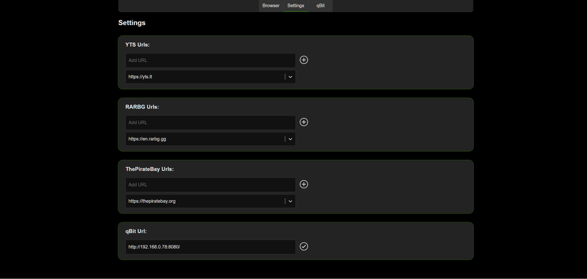
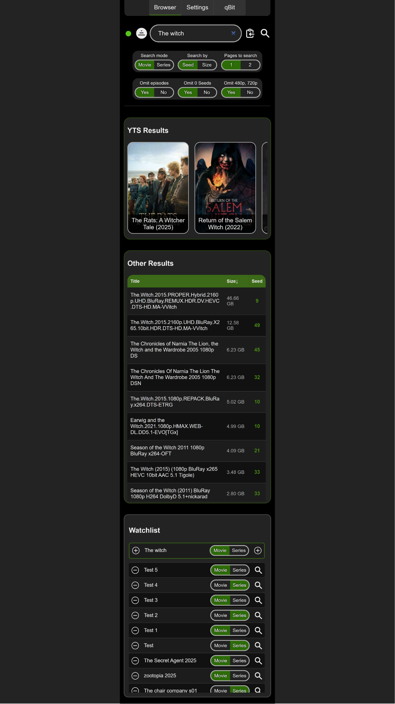

# Multi-Source Content Aggregator

Educational project demonstrating parallel web scraping and data aggregation.

**Technical features:**

- Parallel web scraping with Selenium
- SQLite local database with EF Core
- React frontend with TypeScript
- Docker containerization
- Advanced filtering and sorting

**Architecture:**

- Backend: ASP.NET Core, Selenium WebDriver, SQLite
- Frontend: React, TypeScript, Vite
- Deployment: Docker containers

This is a learning project to practice web scraping, async operations, and full-stack development.

**Front page:**

**Download Modal:**

**Settings page:**

**Mobile:**

